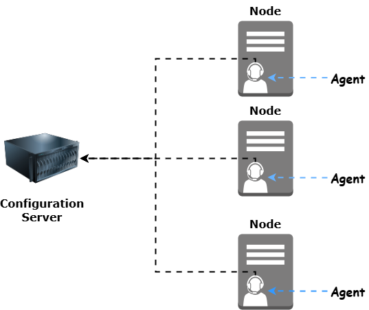

# What is configuration

*provision a server to host a application is known as configuration*

## Steps involved in this process are

### Step 01. Installing system packages

In this step we will install the system packages like zip, unzip etc.,

### Step 02. Installing the programming language or runtime 

In this step we will install programming software on which the application is built for example java, python, node etc.,

### Step 03. Creating some resources for application

In this step we will create a system user for application, and a dedicated working directory for application. 

### Step 04. Downloading the package or source code

In this step we will download the source code of the application and copy that into the directory which we have created in previous step.

### Step 05. Installing the dependencies

In this step we will install the dependencies for application.

### Step 06. Running the application as a service

In this step we will create a service for application and then enable the service and start the service.

## What is configuration management tool ?

Tool used to provision and configure the server is called as configuration management tool.

**Before understanding configuration management tool we need to understand two concepts of system design they are:**

***1.Pull or Poll Design***
***2.Push Design***

### 1.Push or Poll Design:

In this design we should continuously monitor the configuration server.

**Configuration server:** a server in which configuration tool is installed and all the configurations are stored in this server.

**Node:** Servers which are connected to configuration server and configured using the conifguration tool.

**Agent**: Tool installed in node servers to connect with configuration server.

let us take a daily life example

you are in india and there is letter for you from us through fedex

if there is no delivery agent then you need to go to office daily and check if the letter is recieved or not.

In this method there are some disadvantages they are:

1. Time waste
2. Money waste
3. Resource waste -> human
4. Increasing the Traffic on roads.

